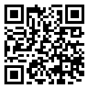
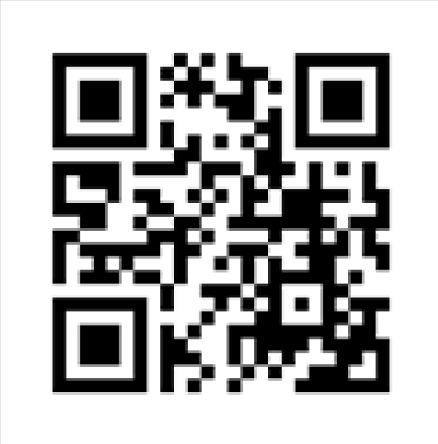

# Mon expérience en réalité augmentée

## Explication de mon expérience
J'ai créé ma carte de visite en m'appuyant sur une de mes compétences que je souhaitais mettre en avant, j'ai choisi pour cela l'intégration web. J'ai représenté sur ma carte de visite des lignes de code qu'on peut retrouver dans un data.js, ces lignes de code représentent mes informations personnelles afin qu'une personne puisse me recontacter. Mon expérience s'appuie sur des briques de Lego, avec des bouts de code dessus, de plus, chaque brique possède une couleur différente qui la couleur de chaque thème de Visual Studio Code. Au début de l'expérience, les Legos s'animent afin de s'assembler comme si on construisait quelque chose avec les Legos. Cette animation justifie également la construction des lignes de code quand on crée un site internet. Chaque Lego contient un bout de code, une ligne de Lego forme une ligne de code et à la fin, quand chaque Lego s'est assemblé, cela forme plusieurs lignes de code qui justifie et montre mon slogan qui est : ***"Briques assemblées, mondes codés"***

## Ma carte de visite
### Face de la carte de visite avec le QR code emmenant vers le site

## --------------------------------------------------------------------------------------------------------

### Dos de la carte de visite avec le QR code montrant l'expérience

## QR code lien expérience AR
### QR code menant au site de l'expérience

### QR code permettant de faire afficher l'expérience

